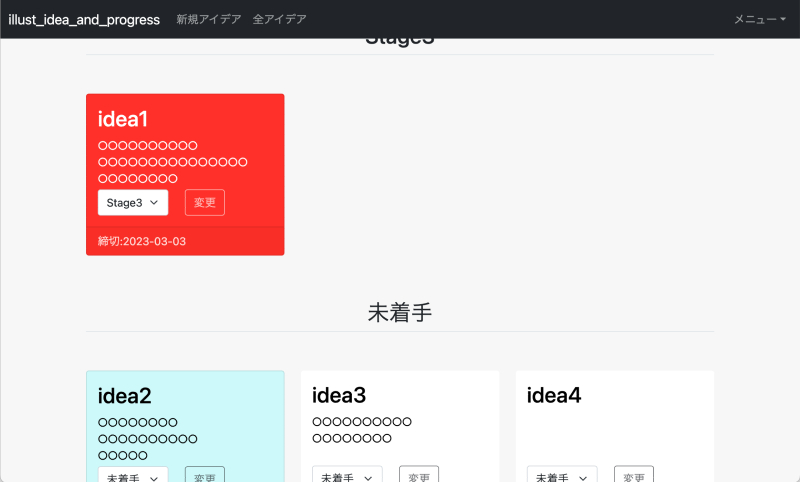

# illust_idea_and_progress

創作のアイデアを整理して、完成までの進捗管理を行うことができるWebアプリケーションです。

PC,スマートフォンいずれにも対応するレスポンシブデザインになっています。

実際に動作してるページはこちら(<https://illust-idea-and-progress.com/>)

## 開発環境

### バックエンド

#### フレームワーク

[Drogon](https://drogon.org/)

#### 言語

C++

#### データベース

[PostgreSQL](https://www.postgresql.org/)

##### ER図

### フロントエンド

#### フレームワーク

[Bootstrap5](https://getbootstrap.jp/)

#### 言語

HTML5,CSS3,JavaScript

## 主な機能

- ユーザー登録,ログイン機能,パスワードは適切に暗号化して保存
- アイデアの作成,編集,削除
- 進捗状況の追加,編集,削除,並び替え
- 各アイデアの進捗状況の変更
- アイデアにタグを追加,削除,タグを用いた絞り込み

## 今後実装を検討中の機能

- Twitterを用いたログイン機能の実装
